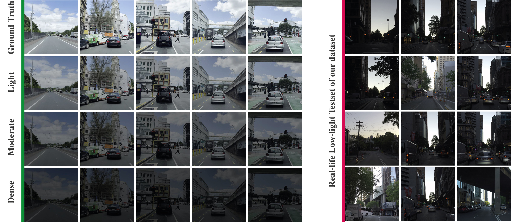
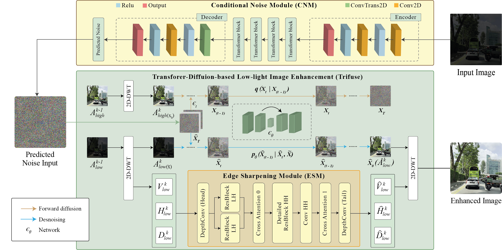

<h4 align="center"><strong><a href="https://accv2024.org/">Published: ACCV'24, Hanoi, Veitnam</a></strong></h4>
<h3 align="center"><strong>LoLI-Street: Benchmarking Low-Light Image Enhancement and Beyond (<strong><a href="https://openaccess.thecvf.com/content/ACCV2024/html/Islam_LoLI-Street_Benchmarking_Low-light_Image_Enhancement_and_Beyond_ACCV_2024_paper.html">Paper</a>)</strong></h3>


<h6 align="center">Md Tanvir Islam<sup> 1</sup>, Inzamamul Alam<sup> 1</sup>, Simon S. Woo<sup> 1, *</sup>, Saeed Anwar<sup> 2</sup>, IK Hyun Lee<sup> 3</sup>, Khan Muhammad<sup> 1, *</sup></h6>
<h6 align="center">| 1. Sungkyunkwan University, South Korea | 2. ANU, Australia | 3. Tech University of Korea, South Korea || *Corresponding Author |</h6>
<hr>

### NEWS 
- Trained weights will be uploaded soon.
- Proposed TriFuse model code is updated.
- Dataset is uploaded online.
  
----------
### Dataset Download
1. **Kaggle:** https://www.kaggle.com/datasets/tanvirnwu/loli-street-low-light-image-enhancement-of-street
2. **Google Drive:** https://drive.google.com/file/d/1xfATFqrYvMU5a4eLJ5iMi7PVts1x3mmi/view?usp=sharing

----------
### LoLI-Street Dataset

## Proposed: TriFuse


### Dependencies
```
pip install -r requirements.txt
````

### How to train?

You need to modify datasets/dataset.py and configs/*.yml slightly for your environment, and then:

```
python train.py  
```
How to test?
```
python evaluate.py
```


## Cite this Paper

If you find our work useful in your research, please consider citing our paper and star ✨✨ this repository. Thank you!

```bibtex
@InProceedings{Islam_2024_ACCV,
    author    = {Islam, Md Tanvir and Alam, Inzamamul and Woo, Simon S. and Anwar, Saeed and Lee, IK Hyun and Muhammad, Khan},
    title     = {LoLI-Street: Benchmarking Low-light Image Enhancement and Beyond},
    booktitle = {Proceedings of the Asian Conference on Computer Vision (ACCV)},
    month     = {December},
    year      = {2024},
    pages     = {1250-1267}
}
